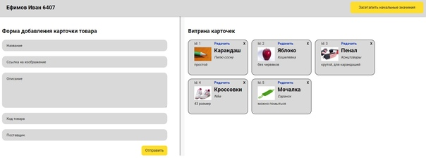
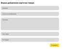
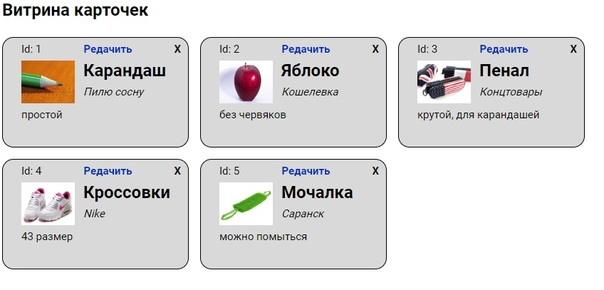

# Empty vite template

Админка карточек (товаров):

Слева присутствует форма для создания и добавления и редактирования карточек:

Справа есть витрина, которая показывает все созданные карточки, у карточек есть кнопка редактировать и удалить:

Инструкция по запуску:

Для запуска сервера:
- npm install -g json-server
База данных приведена в файле db.json
Запустить JSON сервер:
- json-server --watch db.json

- Введите команду `npm i` для установки необходимых зависимостей.
- После успешной установки пакетов запустите dev-сервер введя команду `npm run dev`. В командной строке будет указан адрес и порт, на котором запустится сервер.
- Откройте указанный адрес в браузере. Вы увидите, как ваш проект отображается в браузере.
- Начните разработку вашего приложения.
